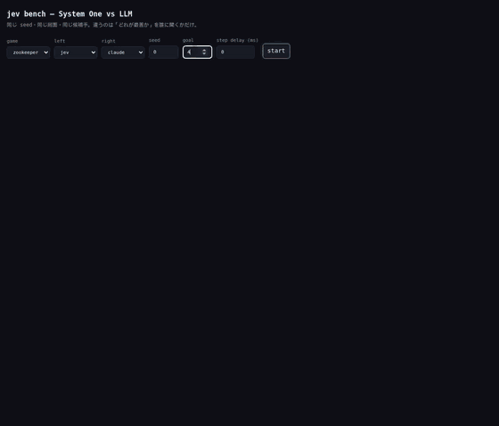
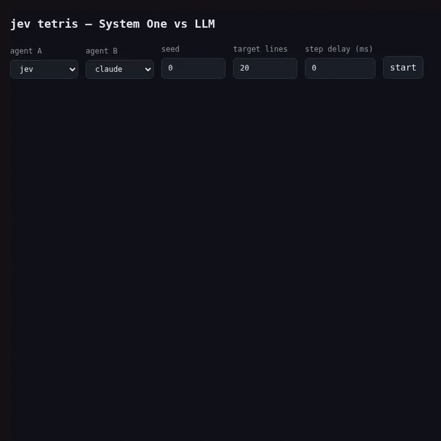

# jev_practice

Jev（TypeSafe の **System One** モデル）と LLM（Claude Haiku 4.5）に
**同じゲームの同じ局面**を打たせて、レイテンシ・コスト・判断の質を並べて見る練習台。

元ネタ: [LLM と Jev のテトリス比較検証](https://zenn.dev/yrd/articles/64d4e2f4c3e71c)



（[mp4 版](docs/zookeeper.mp4) / [静止画](docs/zookeeper.png)）

**左が jev、右が claude。**同じ seed・同じ盤面・同じ候補手を配り、違うのは
「どれが最善か」を誰に聞くかだけ。盤面の下にレベル・スコア・タイマー・動物ごとの
ノルマ・使用トークン・累計コスト・レイテンシ中央値・フォールバック数が並ぶ。

> 枠が緑の `lead` は**その時点で先行している方**。2 枚は実時間で並走するので、
> 速いエージェントほど同じ瞬間には先に進んでいる。最終的な優劣は
> 走り終わりの summary（`agreement` / `mean_regret` / `cost_usd`）で見ること。

ゲームは 2 つある。どちらも「候補手を列挙 → 上位 12 手に絞る → どれが最善か 1 回だけ聞く」
という同じ形に落としてあるので、**エージェントから見ると違いは state の中身だけ**。

| | `zookeeper` | `tetris` |
|---|---|---|
| 盤面 | 8×8・動物 7 種 | 10×20 |
| 1 手 | 隣り合う 2 匹を入れ替える | ミノを回して落とす |
| 毎手の候補数 | 3〜30 | 9〜34 |
| 目標 | レベル 3 到達 | 20 ライン |
| 効いてくる判断 | **まだ足りない動物を狙う**、連鎖、手詰まり回避 | 穴を作らない、高さを抑える |

## ズーキーパー

本家 [ZOO KEEPER](https://ja.wikipedia.org/wiki/ZOO_KEEPER_(%E3%82%B2%E3%83%BC%E3%83%A0))
（KITERETSU / ROBOT, 2003）のルールに寄せてある。

- 8×8 に **7 種の動物**（ゾウ・キリン・ワニ・パンダ・カバ・サル・ライオン）
- 隣り合う 2 匹を入れ替え、縦か横に 3 匹以上並ぶと消える
- **入れ替えても消せない手はそもそも打てない**（本家と同じ。候補手に出てこない）
- 消えると上から落ちてきて連鎖する
- 動物を捕獲すると**タイマーが回復**し、1 手ごとに減る。0 でゲームオーバー
- **全種**のノルマを満たすとレベルアップ。レベルが上がるほどタイマーの減りが速くなる
- どう動かしても消せなくなったら盤面を総入れ替え（ボーナス点とタイマー回復つき）

### なぜこれをベンチにするか

ノルマが「全種いくつずつ」なので、**一番多く消える手が正解とは限らない**。
ライオンのノルマは終わっていてワニが残っているなら、6 匹のライオンより
3 匹のワニを消す手の方が価値がある。素点だけでは候補の順位が決まらないので、
テトリスより「どれが最善か」の判断が効く。

候補手の評価式:

```
score = 2.0*(まだ足りない動物を消す数)   # ノルマに効く分
      + 0.4*(ノルマ達成済みの動物を消す数) # 余剰はおまけ
      + 3.0*(連鎖 - 1)
      + 2.0*(最長の直線 - 3)
      + 0.3*(打てる手の増減)              # 総入れ替えに追い込まれる手は少し嫌う
```

> 候補の評価だけは**補充なし**で計算している。補充は乱数なので、
> 入れてしまうと同じ盤面でも候補の順位が毎回変わり、`agreement` や
> `mean_regret` が指標として使えなくなる。実際に打つときは補充あり・連鎖ありで解決する。

### 動物アイコン

[Twemoji](https://github.com/jdecked/twemoji)（CC-BY 4.0, © Twitter, Inc and other
contributors）を丸く敷いている。ファイルと対応は
[`jevbench/static/animals/LICENSE.md`](jevbench/static/animals/LICENSE.md)。

## テトリス



（[mp4 版](docs/tetris.mp4)）

記事の評価式をそのまま使う。

```
score = -4*holes + 3*cleared_lines - 0.5*max_height - 0.2*bumpiness
```

## Haiku 4.5 と Jev の比較

### 何が違うのか

| | **Jev**（System One） | **Claude Haiku 4.5**（LLM） |
|---|---|---|
| 出力の形 | テキストを生成しない。型付きの質問に**確率つきの答え**を返す | トークンを生成する。JSON Schema で形だけ縛る |
| 質問の型 | `choice`（択一） / `score`（段階評価） / `noul`（真偽の確率） | 任意。スキーマ次第 |
| 付いてくる情報 | `confidence`、候補ごとの `probabilities` | なし（logprobs は非公開） |
| 向く仕事 | 分類・選択・判定を高頻度で回す | 生成・説明・自由形式の推論 |
| 向かない仕事 | 文章を書く、手順を考える | 1 手 200ms 以内の選択をゲームループで回す |

どちらのゲームも 1 手は「12 個の候補から 1 個選ぶ」だけで、
**文章を作る能力は 1 ミリも要らない**。Jev が効くのはそういう形の仕事。

### 記事で報告されている数値（テトリス）

> 元記事の計測値であって、このリポジトリで測った値ではない。

| 指標 | Jev | Haiku 4.5 |
|---|---|---|
| API レイテンシ（中央値） | 239 ms | 1,011 ms |
| 1 局あたりの推定費用 | $0.006 | $0.15 |
| 20 ライン到達 | 8/10 局 | 9/10 局 |

判断の質はほぼ互角のまま、**約 4 倍速く、約 1/24 のコスト**。

### このリポジトリで測れる指標

`heuristic` エージェント（評価式の最善手をそのまま打つ、API を叩かない基準線）を
同じ seed で走らせて、そこからのズレを見る。

| 指標 | 意味 |
|---|---|
| `progress` / `turns` | 到達したレベル or ライン数 / 打った手数 |
| `median_latency_ms` | 1 手あたり API 往復の中央値 |
| `in_tok` / `out_tok` | 使用トークン（累計） |
| `cost_usd` | 単価からの概算（Haiku はキャッシュ読み書きの割引・割増込み） |
| `agreement` | ヒューリスティック最善手と一致した割合 |
| `mean_regret` | 選んだ手と最善手の評価値の差の平均。0 に近いほど良い |
| `fallbacks` | API が失敗してヒューリスティックに落ちた手数 |

**`fallbacks` が 0 でない行は、そのエージェントを測れていない。**
API が落ちた手はヒューリスティック最善手に逃がして局を止めない作りなので、
全手フォールバックすると `agreement` は 1.0、`mean_regret` は 0.0 になり、
一見すると満点に見えてしまう。必ずここを先に見ること。

## 仕組み

1. seed から初期状態を作る（同じ seed なら全エージェントに同じ局）
2. 現在の局面で打てる手を全部並べる
3. 評価式で上位 12 手に絞る
4. **順番をシャッフルしてから** `A`..`L` のラベルを振る
   （しないとラベル `A` が常に最善になり、盤面を読まずに A と答えるだけで当たる）
5. 各エージェントに「どれが最善か」を 1 回だけ聞く
6. 選ばれた手を打ち、1 手ごとに WebSocket / stdout へ流す

ゲーム側は `games.Game` の形（`start` / `candidates` / `apply` / `progress` /
`rows` / `view`）だけを満たせばよく、ループもエージェントも中身を知らない。

## セットアップ

```bash
uv venv .venv
uv pip install --python .venv/bin/python -e ".[dev]"
cp .env.example .env   # キーを書く
```

### API キー

| エージェント | 必要なもの |
|---|---|
| `heuristic` | 不要。キーが 1 つも無くてもこれは動く |
| `jev` | `TYPESAFE_API_KEY` |
| `claude` | `ANTHROPIC_API_KEY`、または `ant auth login` 済みのプロファイル |

キーが無いエージェントは起動時に理由を出してスキップされる（他は走る）。

#### ロリポップ！AI ゲートウェイ経由で両方まかなう

[ロリポップ！AI ゲートウェイ](https://ai-gateway.lolipop.jp/) は
OpenAI 互換 / Anthropic 互換に加えて、Jev と同じ `POST /v1/systemone`
（型付き確率的判断）を提供している。**キー 1 本で jev と claude の両方**を通せる。

```bash
# .env
TYPESAFE_API_KEY=sk-...            # ゲートウェイの推論用 API キー
TYPESAFE_BASE_URL=https://ai-gateway.lolipop.jp
TYPESAFE_DEFAULT_MODEL=typesafe/jev-latest

ANTHROPIC_API_KEY=sk-...           # 同じキーでよい
ANTHROPIC_BASE_URL=https://ai-gateway.lolipop.jp
JEV_LLM_MODEL=claude-haiku-4-5     # ゲートウェイ上の Haiku の ID（prefix 無し）
```

どちらの SDK も `*_BASE_URL` を自分で読むので、コード側の変更は要らない。

**推論キーの発行**（`mgmt_` で始まるマネジメントトークンが要る。
マネジメントトークンは推論には使えない）:

```bash
ACC=<accountId>; PRJ=<projectId>
BASE=https://ai-gateway.lolipop.jp/console/v1/accounts/$ACC/projects/$PRJ
OP=$(uuidgen); AT=$(uuidgen)

# 1. 発行（この時点では blocked:true で、まだ一覧にも出ない）
curl -s -X POST -H "Authorization: Bearer $MGMT" -H 'Content-Type: application/json' \
  -d "{\"keyAlias\":\"jev-practice\",\"expiresInDays\":30,
       \"operationId\":\"$OP\",\"attemptId\":\"$AT\",\"recovery\":false}" "$BASE/keys"

# 2. 確定（これを忘れるとキーは有効にならない）
curl -s -X POST -H "Authorization: Bearer $MGMT" -H 'Content-Type: application/json' \
  -d "{\"attemptId\":\"$AT\"}" "$BASE/keys/provisioning/$OP/confirm"
```

平文のキーは 1. のレスポンスの `key.key` に**一度だけ**返る。

**前提となるアカウント設定**（どちらも足りないと全手フォールバックになる）:

- **残高**: prepaid なので、チャージが無いと `402 billing_error / Insufficient balance`
- **`typesafe/jev-latest` の利用許可**: 既定では
  `403 permission_error / model_not_allowed`。ダッシュボードで許可が要る

## 実測する

```bash
# API 不要の基準線
.venv/bin/jev-bench --agent heuristic --games 10

# jev と claude を同じ seed で 10 局ずつ
.venv/bin/jev-bench --agent jev --agent claude --games 10

# テトリスで同じことをする
.venv/bin/jev-bench --game tetris --agent jev --agent claude --games 10

# 1 手ずつ JSON で見る
.venv/bin/jev-bench --agent jev --verbose
```

### ブラウザで 2 つの盤面を並べる

```bash
.venv/bin/uvicorn jevbench.server:app --reload
# http://127.0.0.1:8000
```

左右に 1 枚ずつパネルが出て、盤面・レベル・スコア・タイマー・動物ごとのノルマ・
**使用トークン（in / out）・累計コスト**・レイテンシ中央値・一致率・
フォールバック数がリアルタイムで並ぶ。

`step delay (ms)` は 1 手ごとの待ち時間。`heuristic` は API を叩かないので
既定の 0 だと一瞬で終わる。目で追いたいときや録画するときに 100〜300 にする
（CLI なら `--step-delay-ms`）。

## 構成

```
jevbench/
├── core.py                 候補手・決定・1 手の記録・エージェント基底
├── match.py                1 局を回してイベントを吐くループ（ゲーム非依存）
├── cli.py                  CLI
├── server.py               FastAPI + WebSocket
├── static/index.html       Vanilla JS のビューア
├── static/animals/         動物アイコン（Twemoji, CC-BY 4.0）
├── games/
│   ├── base.py             Game プロトコル
│   ├── zookeeper.py        8x8・動物 7 種・ノルマ・タイマー・連鎖
│   └── tetris.py           盤面・7 種ミノ・7-bag・ハードドロップ
└── agents/
    ├── heuristic_agent.py  API を叩かない基準線
    ├── jev_agent.py        System One に choice + noul を 1 往復で聞く
    └── claude_agent.py     Haiku 4.5 に json_schema の enum で答えさせる
```

## コスト計算について

Haiku 4.5 は公表単価（入力 $1.00 / 出力 $5.00 per MTok）に、
キャッシュ書き込み ×1.25・キャッシュ読み出し ×0.10 を掛けて積算している。

Jev 側の単価は `JEV_INPUT_PRICE` / `JEV_OUTPUT_PRICE` で差し替えられる
（既定値は暫定なので、契約した単価に合わせること）。

## テスト

```bash
.venv/bin/python -m pytest tests -q
```

両ゲームのエンジンとループを見る。API は叩かないので課金されない。
